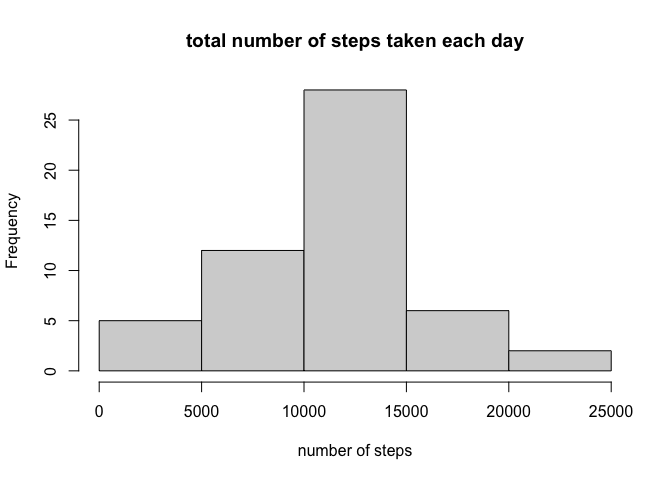
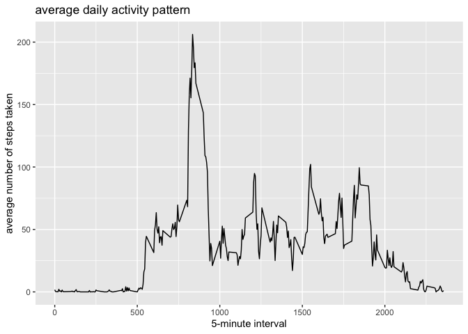
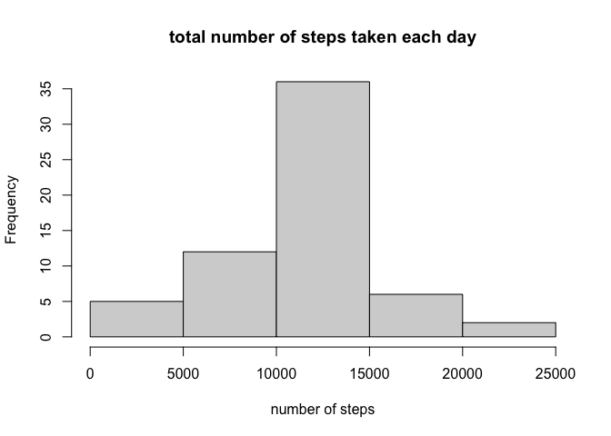
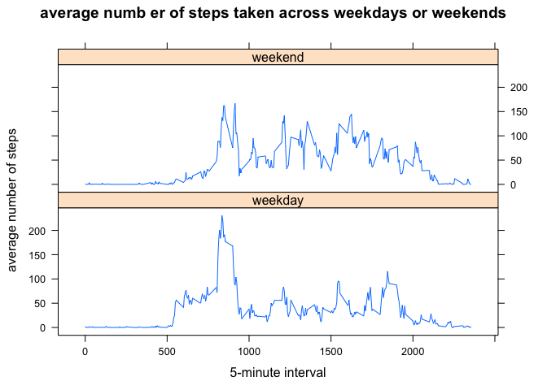

## Loading and preprocessing the data

Unzip the dataset and load the data by using read.csv()

```r
activity <- download.file("https://d396qusza40orc.cloudfront.net/repdata%2Fdata%2Factivity.zip", destfile ="activity.zip")
activity <- unzip("activity.zip")
activitydata <- read.csv(file = "./activity.csv", header = TRUE )
```


## What is mean total number of steps taken per day?

```r
# calculate the total number of steps taken per day
totalsteps <- aggregate(activitydata$steps, by = list(activitydata$date), FUN = sum)

# make a histogram of the total number of steps taken each day
hist(totalsteps$x, xlab = "number of steps", main = "total number of steps taken each day")
```

<!-- -->

```r
# calculate and report the mean and median of the total number of steps taken per day
meansteps <- mean(totalsteps$x, na.rm = TRUE)
mediansteps <- median(totalsteps$x, na.rm = TRUE)
```
The mean of the total number of steps taken per day is 1.0766189\times 10^{4}.
The median of the total number of steps taken per day is 10765.

## What is the average daily activity pattern?

```r
# make a time series plot of the 5-minute interval (x-axis) and the average number of steps taken, averaged across all day (y-axis)
library(ggplot2)
nonactivitydata <- na.omit(activitydata)
meanstepsbyInt <- aggregate(nonactivitydata$steps, by = list(nonactivitydata$interval), FUN = "mean")
qplot(Group.1, x, data = meanstepsbyInt, main = "average daily activity pattern", xlab = "5-minute interval", ylab = "average number of steps taken", geom = "line")
```

<!-- -->

```r
# which 5-minute interval, on average across all the days in the dataset, containing the maximum number of steps
maximum <- nonactivitydata[which.max(nonactivitydata$steps), 3]
```

## Imputing missing values

```r
# calculate and find out the total number of missing values in the dataset
totalmissing <- sum(is.na(activitydata))
totalmissing
```

```
## [1] 2304
```

```r
# fill in all of the missing values in the dataset
library(dplyr)
```

```
## 
## Attaching package: 'dplyr'
```

```
## The following objects are masked from 'package:stats':
## 
##     filter, lag
```

```
## The following objects are masked from 'package:base':
## 
##     intersect, setdiff, setequal, union
```

```r
names(meanstepsbyInt)[names(meanstepsbyInt) == "Group.1"] <- "interval"
mean_steps <- inner_join(activitydata, meanstepsbyInt, by = "interval")
fill_na <- function(dataset, column = 1, replacement = 4) {
  for (i in 1:nrow(dataset)) {
    if (is.na(dataset[i, column])) {
                dataset[i, column] <- dataset[i, replacement]
        }
  }
  dataset
}

# create a new dataset that is equal to the original dataset but with the missing data filled in
newactivitydata <- fill_na(mean_steps)
missingnow <- sum(is.na(newactivitydata))

# a panel plot containing a time series plot
newtotalsteps <- aggregate(newactivitydata$steps, by = list(newactivitydata$date), FUN = sum)
hist(newtotalsteps$x, xlab = "number of steps", main = "total number of steps taken each day")
```

<!-- -->

```r
# differences from the estimates from the first part of the assignment
newmeansteps <- mean(newtotalsteps$x, na.rm = TRUE)
newmediansteps <- median(newtotalsteps$x, na.rm = TRUE)
```

## Are there differences in activity patterns between weekdays and weekends?

```r
# create a new factor variable in the dataset with two levels - "weekday" and "weekend" 
newactivitydata$day <- weekdays(as.Date(newactivitydata$date))
newactivitydata$week <- ifelse((newactivitydata$day == "Saturday" | newactivitydata$day == "Sunday"), "weekend", "weekday")

# make a panel plot containing a time series plot of the 5-minute interval (x-axis) and the average number of steps taken, averaged across all weekday days or weekend days (y-axis)
library(lattice)
newmeanstepsbyInt <- aggregate(newactivitydata$steps, by = list(newactivitydata$interval, newactivitydata$week), FUN = "mean")
xyplot(x ~ Group.1 | Group.2, data = newmeanstepsbyInt, type = "l", xlab = "5-minute interval", ylab = "average number of steps", main = "average numb er of steps taken across weekdays or weekends", layout = c(1,2))
```

<!-- -->
